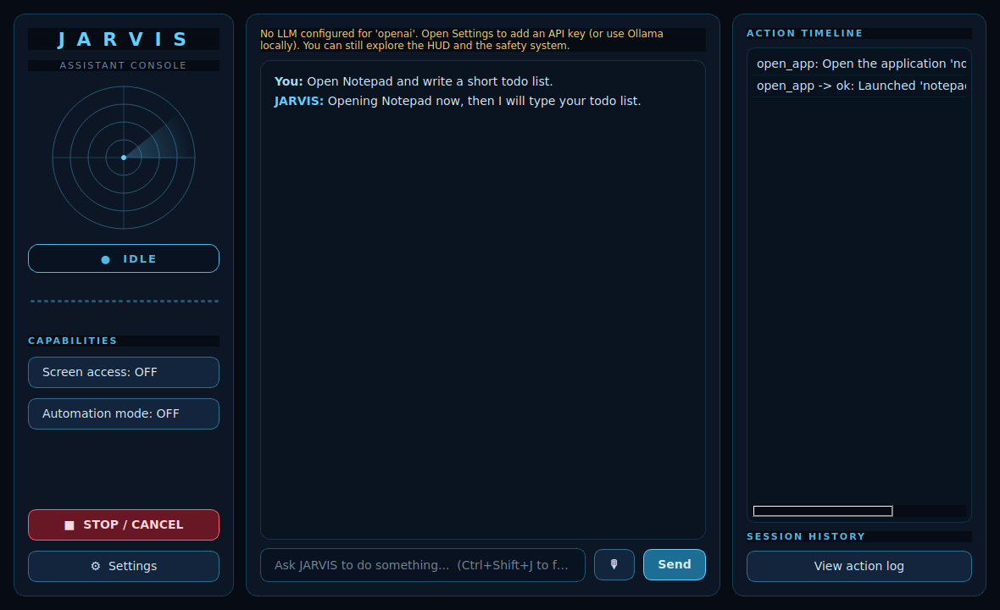

# JARVIS — Desktop AI Assistant

A Windows-first desktop AI assistant with an original futuristic sci-fi HUD and a
**safety-gated, tool-using agent**. JARVIS can chat by text (voice is scaffolded),
open apps and files, and—once you explicitly enable them—drive a browser and
control the desktop. Every medium/high-risk action passes through a safety layer
that asks for your confirmation first. **You always stay in control.**

This is an original assistant console. It contains **no** copyrighted Iron
Man / Marvel assets; all HUD artwork is drawn procedurally with Qt.



---

## What's implemented

This build delivers **Phase 1 + Phase 2 fully working**, with Phases 3–7
scaffolded as safe, well-typed stubs.

| Area | Status |
| --- | --- |
| Futuristic HUD (radar, waveform, status panel, timeline, toggles, stop) | ✅ working |
| Text chat + conversation memory | ✅ working |
| LLM providers: OpenAI / Anthropic / Ollama (graceful with no key) | ✅ working |
| Tool registry with pydantic schemas, risk levels, confirmation, previews | ✅ working |
| App tools (open/close/focus/list windows) | ✅ working (Windows-first) |
| File tools (search/open/create/read/write/move/delete/list) | ✅ working |
| Safety layer + confirmation dialog (Allow once / Deny / Always allow) | ✅ working |
| SQLite logging + Session History panel | ✅ working |
| Tests (safety, registry, file tools, agent loop) | ✅ working |
| Voice: push-to-talk STT (OpenAI Whisper) + TTS (pyttsx3) | ✅ working (opt-in) |
| Wake word / always-on mic | ⛔ intentionally not implemented |
| Browser automation — visible Playwright window | ✅ working (opt-in install) |
| Desktop control (click/type/screenshot/OCR) | ✅ working, OFF by default |
| Gmail / Google Calendar (OAuth/API) | ✅ working (opt-in setup) |
| Secrets (API keys / OAuth tokens) encrypted at rest | ✅ working |

"Safe stub" means the tool is fully registered with the correct schema, risk
level, and preview, but its `execute()` returns a clear *"not enabled / how to
set up"* message instead of performing anything. Nothing unsafe ever runs.

---

## Architecture

```
jarvis/
  app/        main.py (entrypoint), config.py (.env), settings.py (pydantic + SQLite)
  ui/         main_window.py, hud_widgets.py, confirm_dialog.py, settings_dialog.py, styles.qss
  agent/      agent_loop.py, planner.py, memory.py, safety.py, prompts.py
  llm/        base.py, openai_provider.py, anthropic_provider.py, ollama_provider.py, factory.py
  tools/      base_tool.py, registry.py, app_tools.py, file_tools.py,
              browser_tools.py, desktop_tools.py, email_tools.py, calendar_tools.py
  voice/      stt.py, tts.py, wake_word.py
  storage/    database.py, models.py
  tests/      test_safety.py, test_tool_registry.py, test_file_tools.py, test_agent_loop.py
```

**Request flow:** user request → classify intent → ask the LLM (with tool
schemas) → for each requested tool: validate args → **safety check** →
(confirm if needed) → execute → observe → feed back → final reply. The agent
runs on a background thread; the HUD's **Stop** button sets a cancel flag that
is checked between every step.

---

## Safety model

Actions are classified into four risk levels — **low / medium / high / blocked** —
from the tool's declared risk plus heuristics over the actual arguments.

- **Low** (read file, search, open app, navigate): runs without confirmation in
  Controlled/Confirmation mode.
- **Medium** (write file, fill form, run command): requires confirmation.
- **High** (delete file, send email, move files, pay/book, change settings):
  requires confirmation; "Always allow for session" is **not** offered.
- **Blocked** (passwords, 2FA codes, banking pages, financial trades, security
  bypass, credential scraping, keylogging, persistence): **refused** unless you
  turn on Developer mode in Settings — and even then they still require a
  one-time confirmation.

The confirmation dialog shows **what** will happen, **why** it was classified
that way, and the **exact data** involved, with **Allow once / Deny /
Always allow (this session)**.

Capability toggles default to the safe position:

- **Screen access** — OFF by default (gates screenshot/OCR/vision tools).
- **Automation mode** — OFF by default (gates mouse/keyboard control). Enabling
  it prompts a warning. While off, those tools are hidden from the agent entirely.

There is **no** stealth mode, background persistence, keylogging, or
antivirus/firewall tampering anywhere in this project.

---

## Installation

### Windows 11 (primary)

```bat
git clone <your-repo-url>
cd VERSE-Hub\jarvis
copy .env.example .env
REM edit .env and add an API key (or point LLM_PROVIDER=ollama)
run.bat
```

`run.bat` creates a virtual environment, installs the core dependencies, and
launches the app with `python -m jarvis.app.main`.

### Manual / cross-platform (development)

```bash
cd VERSE-Hub/jarvis
python -m venv .venv
source .venv/bin/activate          # Windows: .venv\Scripts\activate
pip install -r requirements.txt
cp .env.example .env               # then edit it
# Run from the repository ROOT (the parent of this folder):
cd ..
python -m jarvis.app.main
```

> The app **never crashes** if no API key is set — it shows a "configure a
> provider" banner and you can still explore the HUD, tools, and safety system.

### Optional capabilities

Uncomment the relevant groups in `requirements.txt` and install:

- **Voice (push-to-talk):** `pip install sounddevice numpy openai pyttsx3`
  (Whisper STT uses your `OPENAI_API_KEY`; pyttsx3 is offline TTS). See the
  Voice section below.
- **Windows automation** (for `list_open_windows` / `focus_window`):
  `pip install pygetwindow` (lightweight) **or** `pip install pywinauto pywin32`.
  If neither is installed, those two tools show a clear setup message and
  **everything else — chat, file tools, voice — keeps working.**
- **Browser:** `pip install playwright && playwright install chromium`
- **Desktop automation:** `pip install pyautogui mss`
- **Gmail/Calendar:** `pip install google-api-python-client google-auth-oauthlib`

---

## Voice (Phase 3) — push-to-talk

Voice is **off by default** and never listens on its own — there is no wake word
and no always-on microphone. Recording happens only while you hold a session
open with the mic button.

**Enable it (Windows):**

```bat
cd VERSE-Hub\jarvis
.venv\Scripts\activate
pip install sounddevice numpy openai pyttsx3
```

Then in the app: open **Settings** → tick **Enable voice**, choose
`openai-whisper` for STT (make sure `OPENAI_API_KEY` is set). **Auto-send
transcript** is ON by default for a fast feel.

**Spoken replies are OFF by default** (the offline pyttsx3 voice is poor). To
turn them on, tick **Read responses aloud** and pick a TTS provider:
- `edge-tts` — high-quality neural voices (recommended): `pip install edge-tts
  soundfile`, then choose a **TTS voice** in Settings.
- `openai-tts` — high quality, uses your `OPENAI_API_KEY`.
- `pyttsx3` — offline fallback, lower quality.
- `none` — never speaks (default).

Press **Stop / Cancel** (or **Esc**) to interrupt speech at any time.

**How it flows:**

1. Click the 🎙 button — JARVIS starts recording (status: **Listening**); the
   button changes to **■ Stop**.
2. Click **■ Stop** (or press **Esc**) to finish — JARVIS transcribes the audio
   (status: **Transcribing**).
3. The text is placed in the chat input, or sent automatically if
   *Auto-send transcription* is on.
4. The assistant responds through the normal agent loop (status: **Thinking** /
   **Acting**).
5. If a TTS engine is available, JARVIS reads the reply aloud (status:
   **Speaking**), then returns to **Idle**.

If the audio backend or API key is missing, JARVIS shows a clear setup message
instead of failing silently. Voice speed is configurable in Settings.

### Troubleshooting: "audio backend missing" even though it's installed

This almost always means JARVIS is running under a **different Python
interpreter** than the virtualenv where you installed `sounddevice`/`numpy`
(or `import sounddevice` is hitting a PortAudio load error inside the app).
JARVIS now helps you see this:

- On startup it logs the running interpreter and writes a **Voice diagnostics**
  line to the action timeline.
- The **Voice diagnostics** button (right panel) shows `sys.executable`, whether
  numpy / sounddevice import, and whether STT/TTS are ready.
- If the mic button can't find the backend, the message names the exact
  interpreter and the real import exception.

Fix: install the backend into the **same** interpreter that runs JARVIS, using
the path shown in the diagnostics — e.g.
`"C:\path\to\jarvis\.venv\Scripts\python.exe" -m pip install sounddevice numpy`
— and make sure you launch JARVIS from that same activated venv (or via
`run.bat`).

---

## Browser automation (Phase 4) — visible

Install: `pip install playwright && playwright install chromium`.

The agent drives a **visible** Chromium window (you can watch every action),
launched with a **separate profile** under `~/.jarvis/browser_profile` — it never
touches your real browser profile. Tools: `open_url`, `search_web`, `click_text`,
`fill_field`, `extract_page_text`, `screenshot_page`, `close_browser`.

Safety: navigation/extraction are low risk; **every click and field-fill asks for
confirmation**, and any text that looks like a login / payment / purchase /
booking / submission is escalated to **HIGH** (allow-once only). Passwords, 2FA
codes, and banking pages remain **blocked** by the safety layer. JARVIS stops
before the final submission and waits for you.

If Playwright isn't installed (or is installed in a *different* interpreter than
the one running JARVIS), the tools show a setup message that names the running
interpreter and the exact commands to run. The **Diagnostics (voice + browser)**
button reports: playwright import ok, chromium installed, browser tools
registered, and visible (not headless) — so a wiring/interpreter problem is
obvious at a glance.

---

## Desktop control (Phase 5) — OFF by default

Install: `pip install pyautogui mss` (OCR also needs `pytesseract pillow` + the
Tesseract binary). Tools: `screenshot_screen`, `click`, `type_text`, `press_key`,
`hotkey`, `scroll`, `locate_text_on_screen`.

Safety: **Automation mode is OFF by default** — while off, these tools are hidden
from the agent entirely. Enabling it prompts a warning. `click` is HIGH risk
(confirm, allow-once); typing/keys/hotkeys require confirmation. Every action is
previewed, logged, and shown as **Acting** in the HUD. pyautogui's fail-safe is
on (slam the mouse into a screen corner to abort) and **Stop/Cancel** cancels
between steps. No stealth, no background persistence, no auto-elevation.

---

## Gmail & Calendar (Phase 6) — OAuth/API, not screen-clicking

Install: `pip install google-api-python-client google-auth-oauthlib`. Then create
a Google Cloud project, enable the **Gmail** and **Calendar** APIs, create an
OAuth **Desktop app** client, download `credentials.json`, and place it in
`~/.jarvis/`. The first Gmail/Calendar action opens a browser to authorize.

Tools: `count_sent_emails`, `search_emails`, `summarize_emails`, `draft_email`,
`send_email`; `list_events`, `find_free_slots`, `create_event`, `delete_event`.

Safety: reading/searching/summarizing and drafting are allowed; **sending email,
creating, and deleting events always require confirmation** (send/delete are
allow-once only). All of this uses the official Google APIs — never screen
automation.

## Secret storage (no plaintext)

API keys and the Google OAuth token are **never** written to the SQLite settings
table. They are encrypted at rest with `cryptography` (Fernet) in
`~/.jarvis/secrets.enc`, with the key in `~/.jarvis/secret.key` (owner-only
permissions). If the crypto backend is unavailable, secrets are kept in memory
for the session only — JARVIS never falls back to plaintext on disk.

---

## Configuration (`.env`)

```
LLM_PROVIDER=openai            # openai | anthropic | ollama
LLM_MODEL=                     # blank = provider default
OPENAI_API_KEY=
ANTHROPIC_API_KEY=
OLLAMA_BASE_URL=http://localhost:11434
```

Settings changed in the in-app **Settings** dialog are stored in SQLite
(`~/.jarvis/jarvis.db`) and take precedence over `.env`.

---

## Running the tests

```bash
cd VERSE-Hub
python -m pytest jarvis/tests -q
```

The tests cover the safety classifier, the tool registry (incl. dynamic risk and
capability filtering), the working file tools, and the agent loop (driven by a
fake LLM provider, no network needed).

---

## Usage examples

- **"Open Notepad and write a short todo list."** → opens Notepad (app tool);
  with desktop automation enabled, would type the list after confirming.
- **"How many emails did I send this week?"** → uses Gmail if configured;
  otherwise explains the one-time OAuth setup.
- **"Find a train from Salzburg to Vienna tomorrow after 14:00."** → (with the
  browser enabled) searches and compares options, and **stops before any
  booking/payment**, asking you to confirm.
- **"Delete all files in Downloads."** → refuses bulk destruction, explains the
  risk, and suggests moving items to a review folder instead.
- **"Send this email to Max."** → drafts it, shows a preview, and sends **only**
  after explicit confirmation.

---

## System tray & global hotkey (Phase 7)

- **Minimize to tray:** closing or minimizing the window hides JARVIS to the
  system tray (toggle in Settings). The tray icon's menu offers *Show JARVIS*,
  *Hide to tray*, and *Quit*; a single click on the icon summons the window.
- **Global hotkey Ctrl+Shift+J:** with the optional `keyboard` package
  installed (`pip install keyboard`), this summons JARVIS even when it's
  minimized or unfocused. Without it, the in-app `Ctrl+Shift+J` shortcut still
  works while the window has focus.
- **Wake word ("Hey Jarvis"):** an **experimental, opt-in, fully offline**
  feature (default OFF). Install `pip install openwakeword sounddevice numpy`,
  enable voice, then tick **Enable wake word** (or use the *Start/Stop Listening*
  button). Detection runs on-device with openWakeWord — **audio is never streamed
  to OpenAI or any cloud**. While listening, the window title and tray tooltip
  show "wake listening" (no stealth). On "Hey Jarvis" it restores/focuses the
  window, sets status to **Listening**, and starts the normal push-to-talk
  recording. It only runs while JARVIS is open (foreground or tray); fully
  quitting stops it. It never listens when voice is disabled. *Start with
  Windows* and *Start minimized to tray* are available in Settings (both OFF by
  default).

## Keyboard

- **Ctrl+Shift+J** — summon / focus JARVIS (global if `keyboard` is installed,
  otherwise in-app).
- **Esc** — emergency stop / cancel the current task (also interrupts speech).

---

## What remains (per stubbed phase)

- **Voice:** ✅ done — push-to-talk capture (`voice/recorder.py`), OpenAI Whisper
  STT, and pyttsx3 TTS are wired into the mic button. Still optional/future:
  a local `faster-whisper` STT backend, Edge/OpenAI TTS voices, and (deliberately
  deferred) wake-word support.
- **Browser:** add a Playwright session manager (separate profile) behind the
  existing `browser_tools.py` schemas; enforce the "stop before payment" rule at
  the action layer (already enforced via risk levels + confirmation).
- **Desktop control:** implement `pyautogui`/`mss` actions behind the
  `desktop_tools.py` stubs; they are already gated by the Automation toggle and
  per-action confirmation.
- **Gmail/Calendar:** implement the Google OAuth flow and API calls behind the
  `email_tools.py` / `calendar_tools.py` schemas; sending/creating/deleting are
  already marked high-risk + confirmation-required.
- **Packaging:** bundle to a Windows `.exe` (e.g. PyInstaller).

---

## License

MIT. Original work — no third-party copyrighted assets included.
